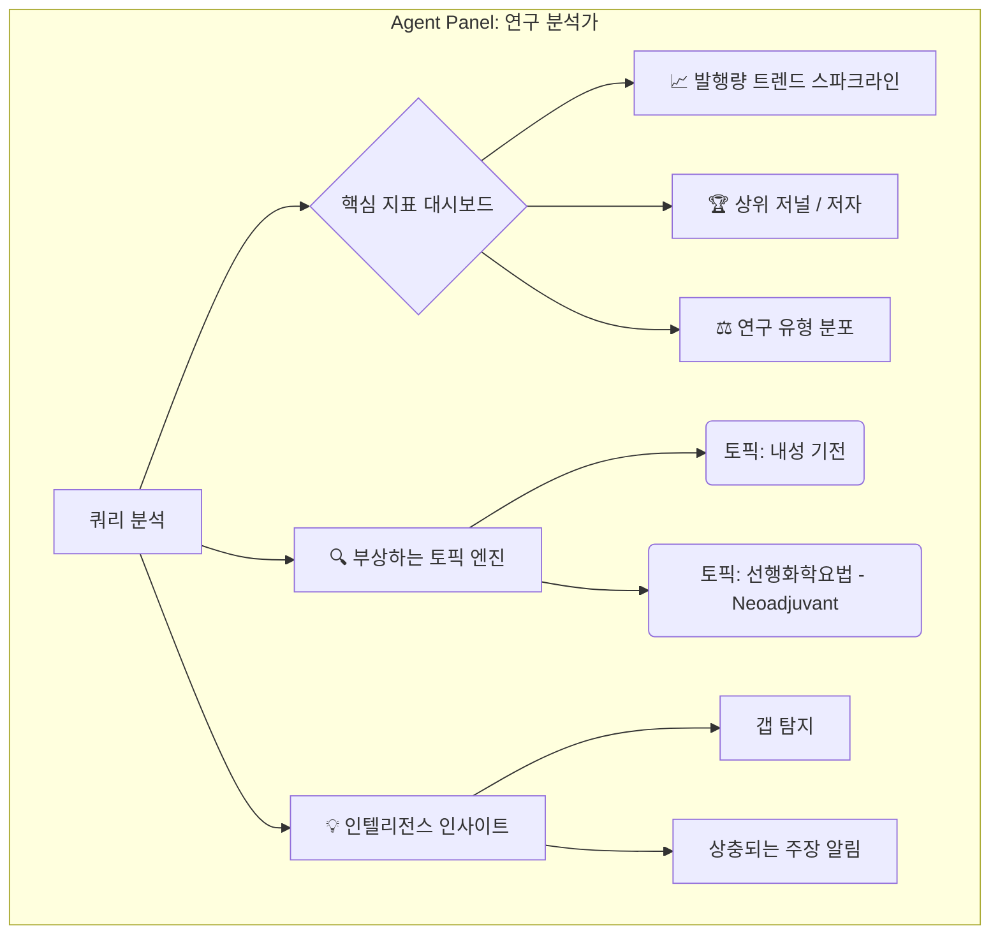
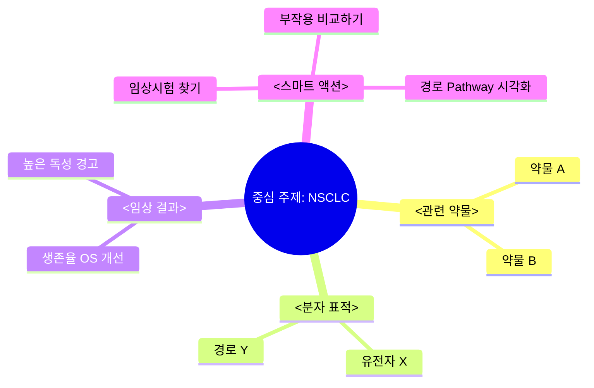

# OARIA 에이전트 UI 컨셉: "`>>` 경험 (The `>>` Experience)"

이 문서는 사용자가 초기 AI 답변을 받은 후 **`>>`** 탭을 클릭했을 때 나타나는 에이전트 UI 요소에 대한 두 가지 뚜렷한 컨셉을 설명합니다. 단순한 텍스트 생성을 넘어 더 깊이 있는 인사이트를 제공하는 것이 목표입니다.

## 🔄 핵심 사용자 흐름 (Core User Flow)

1.  **입력**: 사용자가 복잡한 질문을 합니다 (예: _"비소세포폐암(NSCLC) 3기 환자를 위한 최신 면역항암제 치료법은 무엇인가요?"_).
2.  **응답**: 시스템이 표준 텍스트 기반 RAG 답변을 제공합니다.
3.  **트리거**: 사용자가 **`>>`** (에이전트 확장) 탭/버튼을 클릭합니다.
4.  **액션**: 인터페이스가 확장되며 **에이전트 워크스페이스(Agent Workspace)**가 나타납니다.

---

## 🎨 컨셉 1: "연구 분석가 (The Research Analyst)" (통계 & 트렌드 중심)

**핵심 가치**: 연구 환경에 대한 정량적인 고수준 오버뷰를 제공합니다. 모든 논문을 읽지 않고도 "이 분야에서 무슨 일이 일어나고 있는가?"를 파악하는 데 이상적입니다.

### 1. 대시보드 레이아웃 구조

| 섹션                        | 내용 설명                                                          | 시각화 유형                 |
| :-------------------------- | :----------------------------------------------------------------- | :-------------------------- |
| **헤더 상태**               | "[검색어]와 관련된 논문 12,403편 분석 중..."                       | 상태 바 / 로더              |
| **트렌드 워치**             | 지난 5-10간의 논문 발행량을 통해 관심도 변화 속도 표시.            | 선형 차트 (스파크라인)      |
| **주요 플레이어**           | 이 주제를 다루는 상위 저널, 기관, 저자 순위.                       | 막대 차트 / 랭킹 리스트     |
| **토픽 클러스터**           | 검색 결과를 하위 주제로 그룹화 (예: "부작용", "임상시험", "기전"). | 버블 차트 / 인터랙티브 태그 |
| **연구 갭 (Research Gaps)** | 관심도 대비 논문 발행량이 적거나, 키워드 매칭이 낮은 영역 감지.    | 경고/정보 카드              |

### 2. 상세 기능 명세

#### A. 글로벌 트렌드 분석 (Global Trend Analysis) 📈

연구 주제의 성장 속도와 성숙도를 표시합니다.

- **동작**: 에이전트가 메타데이터에서 발행일을 집계합니다.
- **인사이트 예시**: "_면역관문억제제(Checkpoint Inhibitors)_ 관련 연구는 2023년에 정점을 찍었으며, 전년 대비 45% 성장했습니다."
- **사용자 가치**: 주제가 부상하고 있는지, 안정화되었는지, 쇠퇴하고 있는지 빠르게 파악 가능.

#### B. "영향력(Clout)" 미터 (피인용지수 분포) 🏆

사용자가 정보 출처의 품질과 신뢰도를 판단하도록 돕습니다.

| 저널명                 | 예상 영향력 (Impact) | 논문 수 | 트렌드 (전년비) |
| :--------------------- | :------------------- | :------ | :-------------- |
| _Nature Medicine_      | 높음 (87.2)          | 12      | 🔼 2            |
| _J. Thoracic Oncology_ | 중-상 (20.1)         | 45      | 🔼 5            |
| _Clin. Cancer Res._    | 중간 (13.8)          | 31      | 🔽 1            |

#### C. 연구 갭 & 기회 (Research Gaps & Opportunities) 🚀

에이전트가 코퍼스 빈도와 검색어를 비교하여 _누락된 것_ 또는 *떠오르는 것*을 분석합니다.

- **부상 신호 알림**: "**TIGIT 억제제** 병용 요법이 최근 2024년 논문의 15%에서 언급되었습니다 (2023년 2%에서 증가)."
- **데이터 갭 알림**: "고령 환자(75세 이상)를 대상으로 *프로토콜 A*와 *프로토콜 B*를 직접 비교한 연구가 매우 부족합니다."

### 3. 시각화 목업 (Mermaid)

---

## 🎨 컨셉 2: "지식 항해사 (The Knowledge Navigator)" (연결 & 엔티티 중심)

**핵심 가치**: 답변을 인터랙티브한 지도로 변환합니다. 약물, 유전자, 질병, 예후 간의 "연결 고리(connecting the dots)"를 찾는 데 이상적입니다.

### 1. 대시보드 레이아웃 구조

| 섹션                           | 내용 설명                                                                      | 시각화 유형                |
| :----------------------------- | :----------------------------------------------------------------------------- | :------------------------- |
| **엔티티 맵 (Entity Map)**     | 관계를 보여주는 시각적 노드-링크 다이어그램 (예: 약물 A --억제함--> 유전자 B). | 인터랙티브 네트워크 그래프 |
| **스마트 액션**                | 엔티티 유형에 따라 검색을 전환할 수 있는 상황 인식 버튼.                       | 액션 칩 (Action Chips)     |
| **증거 보드 (Evidence Board)** | 비교를 위해 특정 주장이나 논문을 고정(pin)해두는 드래그 앤 드롭 영역.          | 칸반 / 카드 그리드         |
| **프로토콜 뷰어**              | 관련 논문에서 추출한 투여량, 방법론, 요법 상세 정보.                           | 구조화된 테이블/리스트     |

### 2. 상세 기능 명세

#### A. 인터랙티브 지식 그래프 (Interactive Knowledge Graph) 🕸️

단순한 논문 목록 대신, *과학적 구조*를 보여줍니다.

- **노드**: 약물(예: Pembrolizumab), 유전자(예: PD-L1), 결과(예: OS, PFS), 부작용.
- **엣지(선)**: 관계 (증가시킴, 억제함, 상관관계 있음, 유발함).
- **상호작용**: 노드를 클릭하면 하단의 논문 목록이 해당 엔티티를 언급한 논문들로 필터링됩니다.

#### B. "프로토콜 & 임상시험" 스위처

사용자의 즉각적인 의도에 따라 뷰를 전환할 수 있습니다.

- **탭 A: 기전 (Mechanisms)**: 생물학/경로 설명 및 분자 상호작용에 집중.
- **탭 B: 프로토콜 (Protocols)**: "10mg/kg Q3W"와 같은 데이터, 요법, 투여량에 집중.
- **탭 C: 주장 (Claims)**: "OS의 유의미한 개선 (p<0.05)"과 같은 결과 발췌문에 집중.

#### C. "컨센서스 체크 (Consensus Check)" ✅

에이전트가 특정 포인트에 대해 동의하는 논문과 반대하는 논문을 자동으로 그룹화합니다.

- **진술**: "1기 환자에서 보조요법(adjuvant therapy)이 생존율을 향상시키는가?"
  - **✅ 예 (강력한 증거)**: 12편 (피인용 > 500)
  - **❌ 아니오/엇갈린 증거**: 3편
  - **🤔 결론 없음 (Inconclusive)**: 2편

### 3. 시각화 목업 (Mermaid)

---

## 🆚 비교 및 추천

| 특징            | 컨셉 1: 분석가 (통계)                                  | 컨셉 2: 항해사 (그래프)                              |
| :-------------- | :----------------------------------------------------- | :--------------------------------------------------- |
| **적합 대상**   | 연구비 제안서 작성자, 리뷰 논문 작성, 시장 분석.       | 생물학 연구자, 임상 의사결정 지원, 새로운 분야 학습. |
| **시각적 후크** | 차트, 트렌드, 숫자.                                    | 그래프, 노드, 분자 구조.                             |
| **기술 복잡도** | **중간**: 메타데이터(날짜, 저널) 집계 필요.            | **높음**: 개체명 인식(NER) 및 관계 모델링 필요.      |
| **"Wow" 요소**  | "이게 엑셀 노가다와 요약 시간을 몇 시간이나 줄여주네." | "연결 고리를 보여줘서 전문가처럼 생각하게 도와주네." |

### 💡 종합 추천: 하이브리드 모델 (The Hybrid Model)

**OARIA `>>` 에이전트**의 경우, 두 사용자 유형을 모두 만족시키기 위해 **하이브리드 접근 방식**을 추천합니다.

1.  **기본 뷰 (분석가)**: 열자마자 **"트렌드 스파크라인"**과 **"상위 저널"**을 보여줍니다.
    - _이유_: 로딩이 빠르고, 시각적으로 인상적이며, 새로운 UI 학습 없이도 누구나 이해할 수 있습니다.
2.  **드릴다운 (항해사)**: "토픽 클러스터"에서 키워드를 클릭하면 해당 주제에 대한 미니 그래프나 엔티티 뷰를 열 수 있게 합니다.
    - _이유_: 특정 관계를 탐색해야 하는 파워 유저에게 깊이 있는 정보를 제공합니다.

**예시 에이전트 액션 흐름:**

> 사용자가 `>>` 클릭
>
> 1.  **에이전트**: "논문 50편을 분석했습니다. 연구량이 **가속화**되고 있습니다 📈."
> 2.  **에이전트**: "핵심 논쟁 발견: 3편은 *기전 A*를 주장하는 반면, 2편은 *기전 B*를 주장합니다." (컨센서스 체크)
> 3.  **UI**: 버튼 표시: `[기전 비교하기]` `[발행 트렌드 보기]` `[약물별 클러스터링]`
