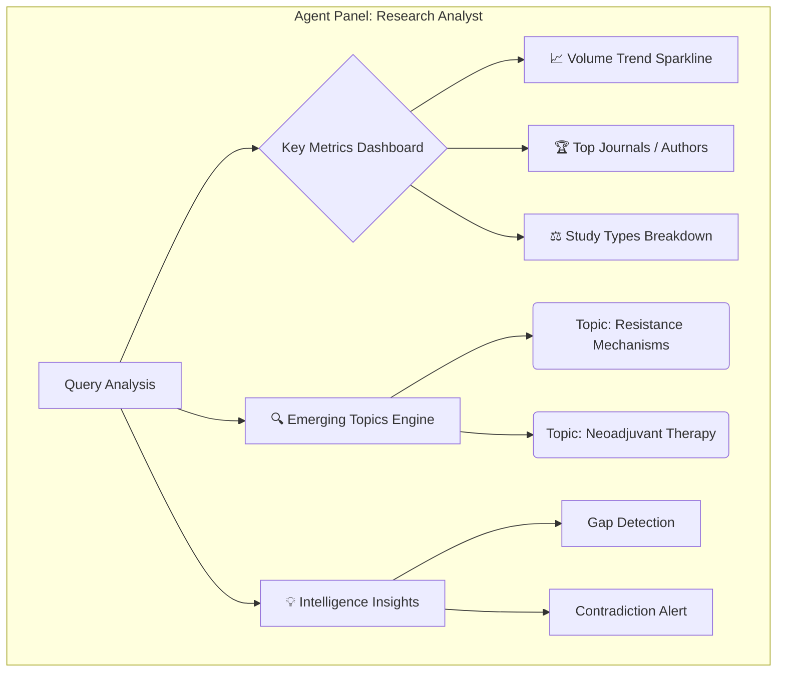
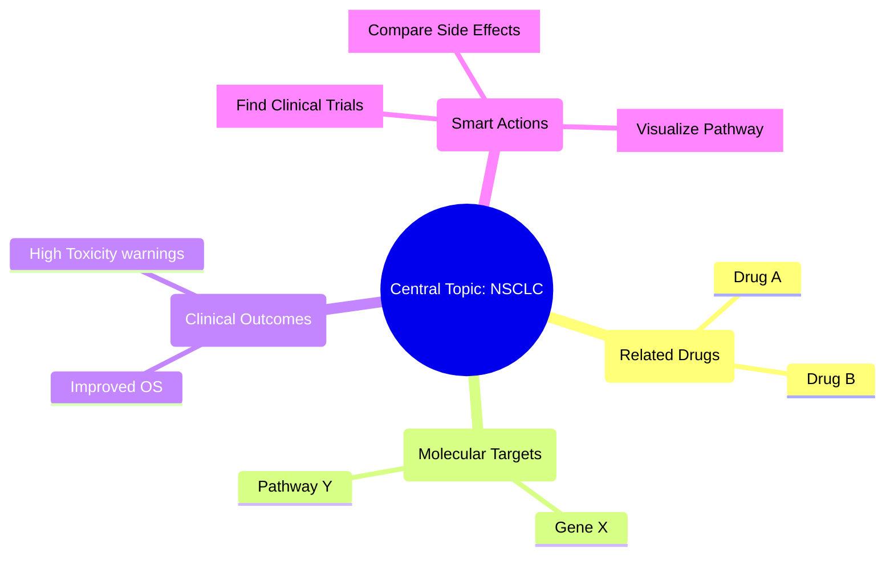

# OARIA Agent UI Concepts: "The `>>` Experience"

This document outlines two distinct concepts for the Agent UI element that appears when a user clicks the **`>>`** tab after receiving an initial AI response. The goal is to provide deeper insights beyond simple text generation.

## 🔄 Core User Flow

1.  **Input**: User asks a complex question (e.g., _"What are the latest immunotherapy approaches for Stage 3 NSCLC?"_).
2.  **Response**: System provides a standard text-based RAG answer.
3.  **Trigger**: User clicks the **`>>`** (Agent Expansion) tab/button.
4.  **Action**: The interface expands to reveal the **Agent Workspace**.

---

## 🎨 Concept 1: "The Research Analyst" (Statistics & Trends Focus)

**Core Value**: Provides a high-level quantitative overview of the research landscape. Ideal for understanding "What is happening in this field?" without reading every paper.

### 1. Dashboard Layout Structure

| Section            | Content Description                                                                                 | Visual Type                     |
| :----------------- | :-------------------------------------------------------------------------------------------------- | :------------------------------ |
| **Header Status**  | "Analyzing 12,403 papers regarding [Query]..."                                                      | Status Bar / Loader             |
| **Trend Watch**    | Publication volume over the last 5-10 years to show interest velocity.                              | Line Chart (Sparkline)          |
| **Key Players**    | Top journals, institutions, and authors publishing on this topic.                                   | Bar Chart / Ranked List         |
| **Topic Clusters** | Grouping of search results into sub-topics (e.g., "Side Effects", "Clinical Trials", "Mechanisms"). | Bubble Chart / Interactive Tags |
| **Research Gaps**  | Areas with high unmatched keywords or low publication volume relative to interest.                  | Warning/Info Cards              |

### 2. Detailed Feature Breakdown

#### A. Global Trend Analysis 📈

Displays the velocity and maturity of the research topic.

- **Action**: Agent aggregates publication dates from metadata.
- **Insight Example**: "Research on _Checkpoint Inhibitors_ peaked in 2023 with +45% growth year-over-year."
- **User Value**: Quickly identify if a topic is emerging, stable, or declining.

#### B. The "Clout" Meter (Impact Factor Distribution) 🏆

Helps users judge the quality and reliability of the source pool.

| Journal Name           | Estimated Impact | Paper Count | Trend (YoY) |
| :--------------------- | :--------------- | :---------- | :---------- |
| _Nature Medicine_      | High (87.2)      | 12          | 🔼 2        |
| _J. Thoracic Oncology_ | Med-High (20.1)  | 45          | 🔼 5        |
| _Clin. Cancer Res._    | Medium (13.8)    | 31          | 🔽 1        |

#### C. Research Gaps & Opportunities 🚀

The Agent analyzes what is _missing_ or _emerging_ by comparing query terms against corpus frequency.

- **Emerging Signal Alert**: "Combination therapy with **TIGIT inhibitors** is mentioned in 15% of recent 2024 papers (up from 2% in 2023)."
- **Data Gap Alert**: "Very few studies compare _Protocol A_ vs _Protocol B_ directly in elderly populations (Age > 75)."

### 3. Visualization Mockup (Mermaid)

---

## 🎨 Concept 2: "The Knowledge Navigator" (Connection & Entity Focus)

**Core Value**: Turns the answer into an interactive map. Ideal for "connecting the dots" between drugs, genes, diseases, and outcomes.

### 1. Dashboard Layout Structure

| Section             | Content Description                                                             | Visual Type               |
| :------------------ | :------------------------------------------------------------------------------ | :------------------------ |
| **Entity Map**      | Visual node-link diagram showing relations (e.g., Drug A --inhibits--> Gene B). | Interactive Network Graph |
| **Smart Actions**   | Context-aware buttons to pivot the search based on entity type.                 | Action Chips              |
| **Evidence Board**  | A drag-and-drop area to pin specific claims or papers for comparison.           | Kanban / Card Grid        |
| **Protocol Viewer** | Extracted dosage, methodology, and regiment details.                            | Structured Table/List     |

### 2. Detailed Feature Breakdown

#### A. Interactive Knowledge Graph 🕸️

Instead of a simple list of papers, show the _science_ structure.

- **Nodes**: Drugs (e.g., Pembrolizumab), Genes (e.g., PD-L1), Outcomes (e.g., OS, PFS), Side Effects.
- **Edges**: Relationships (Increases, Inhibits, Correlates with, Causes).
- **Interaction**: Clicking a node filters the paper list below to just papers mentioning that entity.

#### B. "Protocol & Trial" Switcher

Users can toggle views based on their immediate intent:

- **Tab A: Mechanisms**: Focus on biology/pathway descriptions and molecular interactions.
- **Tab B: Protocols**: Focus on "10mg/kg Q3W" type data, regimens, and dosages.
- **Tab C: Claims**: Focus on results excerpts like "Significantly improved OS (p<0.05)".

#### C. The "Consensus Check" ✅

The Agent automatically groups papers that agree vs. disagree on a specific point.

- **Statement**: "Does adjuvant therapy improve survival in Stage 1?"
  - **✅ Yes (Strong Evidence)**: 12 Papers (Citation > 500)
  - **❌ No/Mixed Evidence**: 3 Papers
  - **🤔 Inconclusive**: 2 Papers

### 3. Visualization Mockup (Mermaid)

---

## 🆚 Comparison & Recommendation

| Feature             | Concept 1: Analyst (Stats)                                   | Concept 2: Navigator (Graph)                                         |
| :------------------ | :----------------------------------------------------------- | :------------------------------------------------------------------- |
| **Best For**        | Researchers writing grants, Review papers, Market analysis.  | Biology researchers, Clinical decision support, Learning new fields. |
| **Visual Hook**     | Charts, Trends, Numbers.                                     | Graphs, Nodes, Molecules.                                            |
| **Tech Complexity** | **Medium**: Requires aggregating metadata (dates, journals). | **High**: Requires Entity Extraction/NER and relationship modeling.  |
| **"Wow" Factor**    | "This saves me hours of Excel work & summaries."             | "This helps me think like an expert by seeing connections."          |

### 💡 Combined Recommendation: The Hybrid Model

For the **OARIA `>>` Agent**, we recommend a **Hybrid Approach** to satisfy both user types:

1.  **Default View (Analyst)**: Show the **"Trend Sparkline"** and **"Top Journals"** immediately upon opening.
    - _Why?_ It's fast to load, visually impressive, and universally understood without learning a new UI.
2.  **Drill-down (Navigator)**: Allow clicking a keyword in the "Topic Cluster" to open a mini-graph or entity view for that specific topic.
    - _Why?_ It provides depth for power users who need to explore specific relationships.

**Example Agent Action Flow:**

> User clicks `>>`
>
> 1.  **Agent**: "I analyzed 50 papers. Research volume is **accelerating** 📈."
> 2.  **Agent**: "Key debate found: 3 papers argue _Mechanism A_, while 2 argue _Mechanism B_." (Consensus Check)
> 3.  **UI**: Shows buttons: `[Compare Mechanisms]` `[View Publication Trend]` `[Cluster by Drug]`
