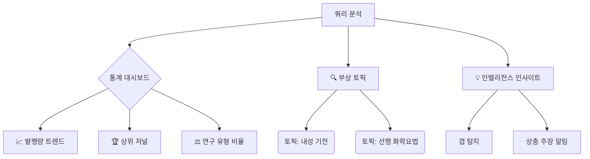
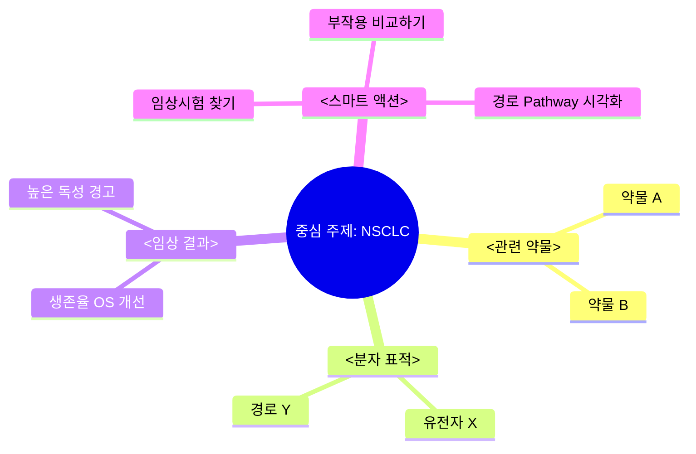

# OARIA 에이전트 UI 하이브리드 (Hybrid) – 한국어 버전

> **목표**: `>>` 탭을 클릭했을 때 **통계·트렌드**와 **지식 그래프**를 동시에 제공하고, 핵심 연구 주제에 대한 **에이전틱(자동) 지원**을 추가합니다.

---

## 1️⃣ 핵심 사용자 흐름 (Core User Flow)

1. **질문 입력** – 사용자가 복합적인 연구 질문을 입력합니다.
2. **기본 RAG 답변** – 시스템이 텍스트 기반 답변을 반환합니다.
3. **`>>` 클릭** – 에이전트 워크스페이스가 열립니다.
4. **하이브리드 패널** – **통계 대시보드**와 **지식 그래프**가 동시에 표시됩니다.
5. **에이전틱 액션** – AI가 자동으로 **핵심 연구 주제**, **가설**, **로드맵**을 제안합니다.

---

## 2️⃣ 하이브리드 UI 레이아웃

| 영역                  | 내용                                               | 시각화 유형                     |
| :-------------------- | :------------------------------------------------- | :------------------------------ |
| **헤더**              | 현재 쿼리와 분석 상태                              | 상태 바 / 로더                  |
| **통계 대시보드**     | 트렌드 차트, 주요 저널·기관, 연구 갭               | 라인 차트, 막대 차트, 알림 카드 |
| **지식 그래프**       | 엔티티(약물·유전자·결과) 간 관계 맵                | 인터랙티브 네트워크 그래프      |
| **에이전틱 인사이트** | 자동 가설·연구 로드맵·핵심 키워드 제안             | 카드 리스트 + 액션 버튼         |
| **스마트 액션 바**    | "기전 비교", "임상시험 찾기", "데이터 다운로드" 등 | 액션 칩                         |

---

## 3️⃣ 통계·트렌드 (Research Analyst) – 핵심 기능

- **Trend Watch** – 연도별 논문 수 스파크라인 (지난 10년).
- **Top Journals / Institutions** – 영향력(Impact Factor) 기반 상위 5개 저널·기관 리스트.
- **Topic Clusters** – 자동 토픽 모델링으로 **부작용**, **임상시험**, **기전** 등 서브‑토픽 표시.
- **Research Gaps** – 검색어 대비 논문 수가 낮은 영역을 **경고 카드**로 표시.
- **Impact Meter** – 저널별 피인용 지표와 논문 수를 한눈에.

### 예시 차트 (Mermaid)

---

## 4️⃣ 지식 그래프 (Knowledge Navigator) – 핵심 기능

- **Entity Map** – 약물, 유전자, 임상 결과 등 **노드**와 관계(**엣지**)를 시각화.
- **노드 클릭** – 해당 엔티티가 포함된 논문 리스트를 **필터링**.
- **프로토콜 & 임상시험 스위처** – `Mechanisms`, `Protocols`, `Claims` 탭 전환.
- **Consensus Check** – 특정 가설에 대한 **동의/반대** 논문 수 자동 집계.

### 예시 마인드맵 (Mermaid)

---

## 5️⃣ 에이전틱 연구 지원 (Agentic Research Features)

| 기능                            | 설명                                                                                                          | 기대 효과                                     |
| :------------------------------ | :------------------------------------------------------------------------------------------------------------ | :-------------------------------------------- |
| **핵심 연구 주제 자동 탐색**    | AI가 현재 쿼리와 연관된 **핵심 키워드** 3~5개를 제안 (예: `TIGIT 억제제`, `Neoadjuvant`, `CAR‑T`).            | 사용자는 빠르게 중요한 주제로 집중할 수 있음. |
| **가설 생성 어시스턴트**        | "이 약물과 유전자의 상호작용이 **생존율**에 미치는 영향을 검증해 보시겠습니까?" 와 같은 **가설**을 자동 제시. | 연구 설계 단계에서 아이디어를 즉시 얻음.      |
| **연구 로드맵 제안**            | 6‑12개월 **로드맵** (문헌 리뷰 → 파일럿 실험 → 임상시험) 을 시각화하여 제공.                                  | 프로젝트 관리와 일정 계획을 자동화.           |
| **자동 논문 요약 & 하이라이트** | 선택된 핵심 논문을 **핵심 문장**과 **표/그림**만 추출해 카드 형태로 제공.                                     | 긴 논문을 빠르게 스캔.                        |
| **다음 단계 제안**              | "다음으로 **TIGIT 억제제**에 대한 메타분석을 수행해 보세요" 와 같은 **액션** 버튼 제공.                       | 사용자가 바로 다음 작업을 실행 가능.          |

---

## 6️⃣ UI 인터랙션 흐름 (예시)

1. 사용자가 `>>` 클릭 → 하이브리드 패널 오픈.
2. **통계 영역**에 트렌드 차트와 연구 갭 카드가 표시.
3. **그래프 영역**에 엔티티 맵이 나타나고, `TIGIT` 노드 클릭 → 해당 논문 리스트 필터링.
4. **에이전틱 인사이트** 카드에
   - `핵심 키워드: TIGIT, Neoadjuvant, CAR‑T`
   - `가설: TIGIT 억제제가 PD‑L1 억제제와 병용 시 OS 향상`
   - `로드맵: 1) 문헌 리뷰 → 2) 메타분석 → 3) 파일럿 실험`
5. 사용자는 카드 버튼을 눌러 **가설 검증** 혹은 **로드맵 다운로드**를 즉시 수행.

---

## 7️⃣ 구현 로드맵 (Technical Steps)

1. **프론트엔드** – React 컴포넌트 `HybridAgentPanel` 제작.
   - 차트는 `recharts` 혹은 `chart.js` 사용.
   - 그래프는 `react-force-graph` 혹은 `d3-force` 활용.
2. **백엔드** – FastAPI 엔드포인트
   - `/agent/hybrid?query=...` → 메타데이터 집계, 엔티티 추출, 가설/로드맵 생성.
3. **AI 서비스** – LLM (예: OpenAI GPT‑4o) 로 **핵심 키워드**, **가설**, **로드맵** 생성.
4. **캐시** – Redis에 메타데이터와 그래프 데이터를 캐시해 빠른 응답 보장.
5. **테스트** – E2E 테스트 (Cypress)와 유닛 테스트 (Jest) 작성.

---

## 8️⃣ 결론

- **하이브리드 UI**는 **통계**와 **그래프**를 동시에 제공해 사용자가 데이터를 다각도로 탐색하게 합니다.
- **에이전틱 기능**은 연구자에게 **핵심 주제**, **가설**, **로드맵**을 자동으로 제시해 연구 효율을 크게 높입니다.
- 구현 단계는 **프론트엔드 컴포넌트**, **백엔드 API**, **AI 가설 생성** 순으로 진행하면 됩니다.

---

_이 문서는 OARIA 팀이 `>>` 에이전트 기능을 확장하고, 연구자에게 **에이전틱 연구 지원**을 제공하기 위한 설계 가이드입니다._
