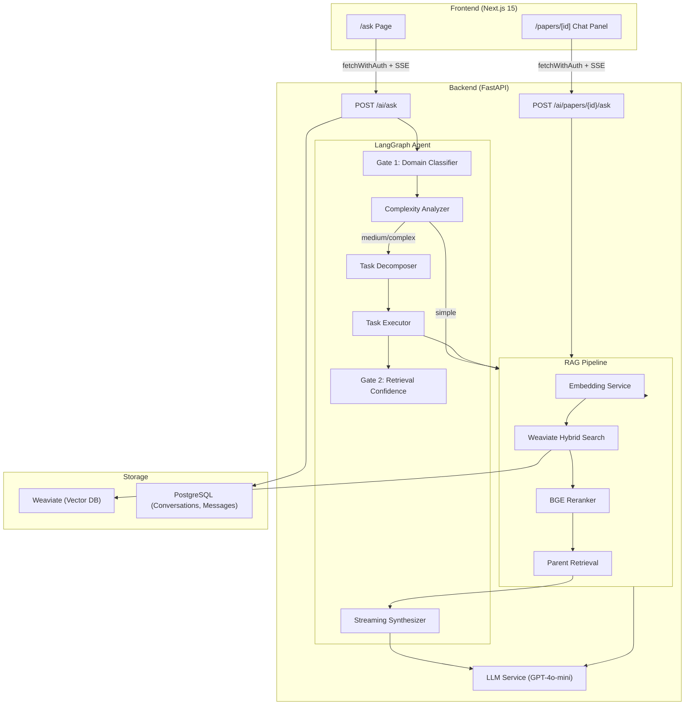
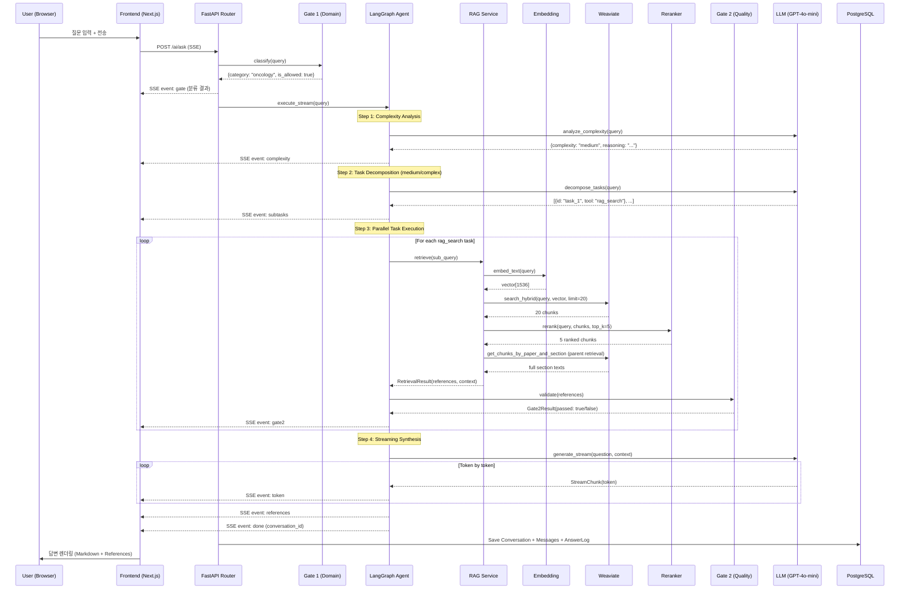
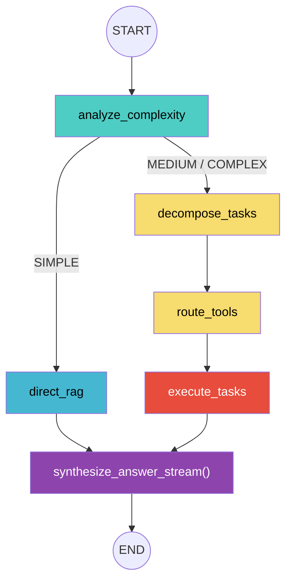
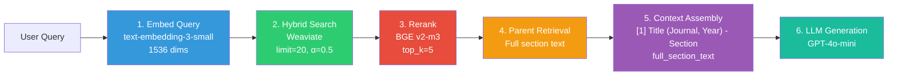
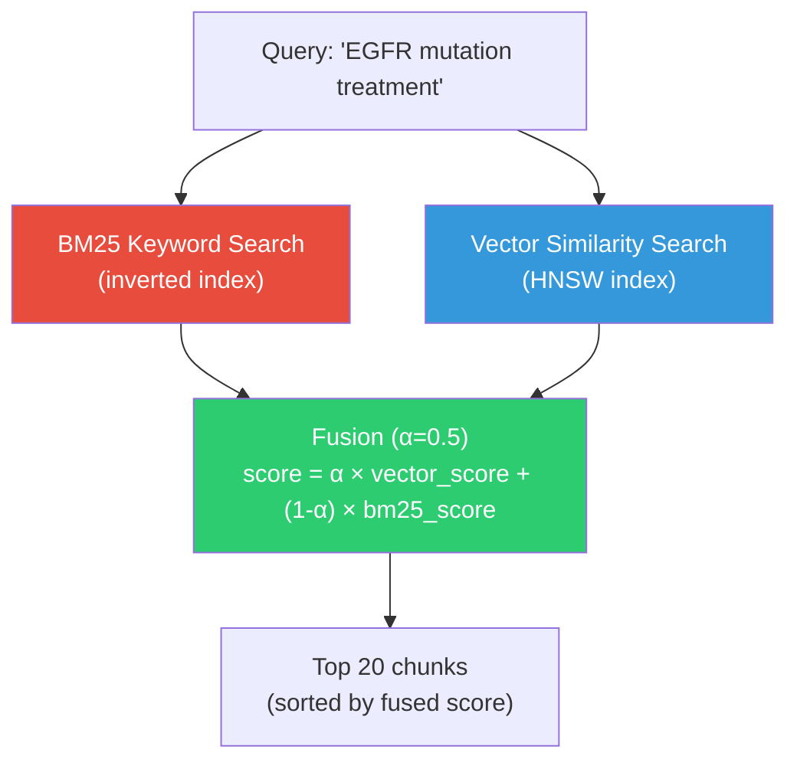
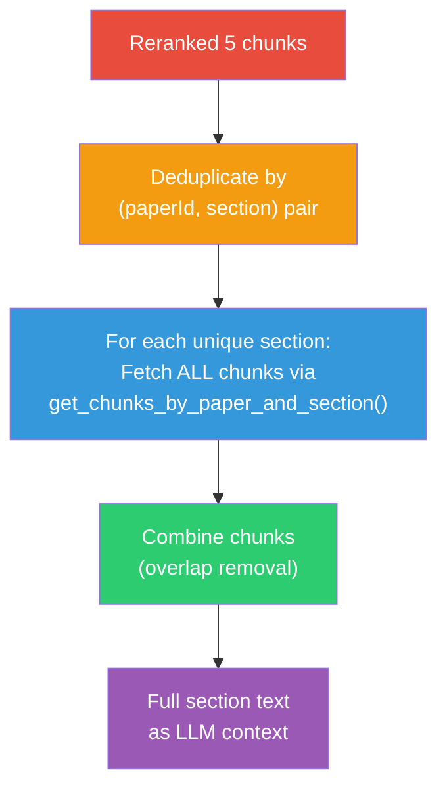
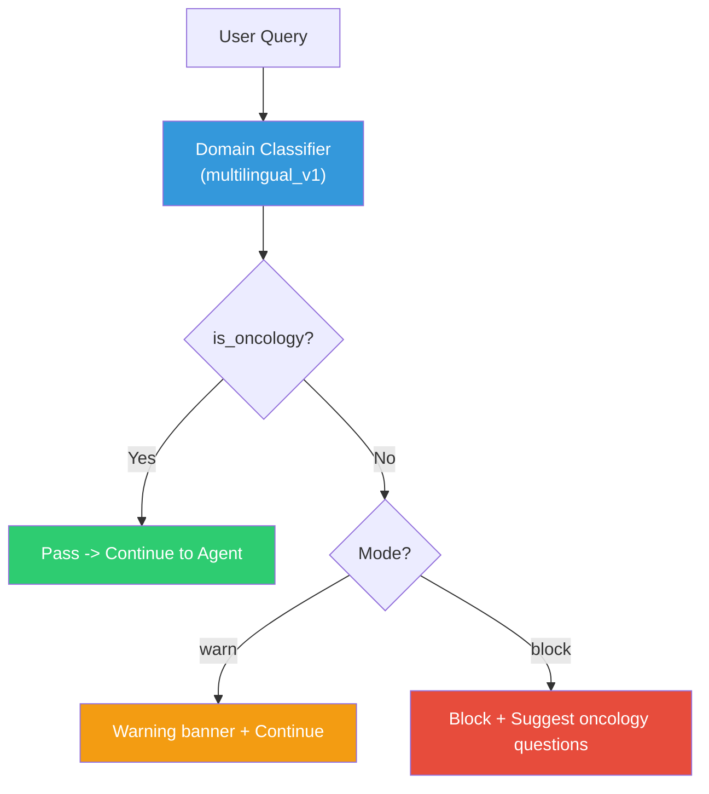
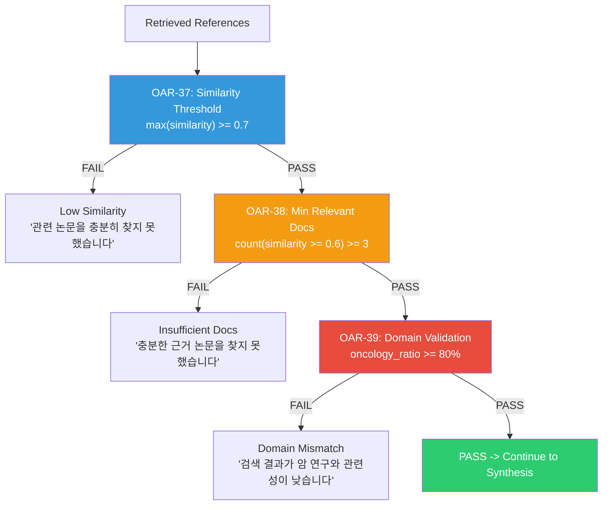
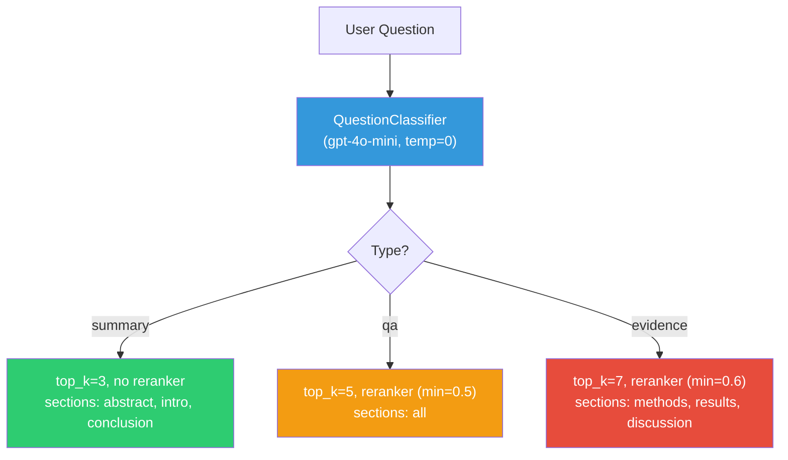
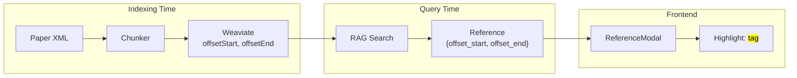

# OARIA Ask AI -- Complete Architecture Documentation

> 이 문서는 OARIA 플랫폼의 "Ask AI" 기능이 사용자 질문을 받아 근거 기반 답변을 생성하기까지의 **전체 파이프라인**을 상세히 기술합니다.
> Chunking, Embedding, Hybrid Search, Reranking, Parent Retrieval, Gate 시스템, LangGraph Agent 오케스트레이션, SSE 스트리밍까지 모든 계층을 다룹니다.

---

## Table of Contents

1. [System Overview](#1-system-overview)
2. [Two Pipelines: General Ask vs Paper Ask](#2-two-pipelines-general-ask-vs-paper-ask)
3. [End-to-End Flow (General Ask)](#3-end-to-end-flow-general-ask)
4. [LangGraph Agent Architecture](#4-langgraph-agent-architecture)
5. [RAG Pipeline Deep Dive](#5-rag-pipeline-deep-dive)
6. [Chunking Strategy](#6-chunking-strategy)
7. [Embedding](#7-embedding)
8. [Weaviate Vector DB & Hybrid Search](#8-weaviate-vector-db--hybrid-search)
9. [Reranker (Cross-Encoder)](#9-reranker-cross-encoder)
10. [Parent Retrieval Pattern](#10-parent-retrieval-pattern)
11. [Gate System (Quality Control)](#11-gate-system-quality-control)
12. [LLM Response Generation](#12-llm-response-generation)
13. [Paper-Specific Chat Pipeline](#13-paper-specific-chat-pipeline)
14. [Highlight & Offset System](#14-highlight--offset-system)
15. [Frontend SSE Streaming](#15-frontend-sse-streaming)
16. [Summarization & Citation](#16-summarization--citation)
17. [Example Scenarios](#17-example-scenarios)
18. [LangGraph 활용 시 고려사항](#18-langgraph-활용-시-고려사항)
19. [Technology Stack Summary](#19-technology-stack-summary)

---

## 1. System Overview



---

## 2. Two Pipelines: General Ask vs Paper Ask

OARIA는 두 개의 독립적인 Ask AI 파이프라인을 제공합니다.

| 구분 | General Ask (`/ai/ask`) | Paper Ask (`/ai/papers/{id}/ask`) |
|------|------------------------|-----------------------------------|
| **용도** | 모든 종양학 질문 (cross-paper) | 특정 논문 내 질의응답 |
| **Gate 1 (도메인)** | 적용 (oncology 확인) | 미적용 (이미 논문 컨텍스트) |
| **오케스트레이션** | LangGraph Agent (복잡도 분석) | 직접 RAG 파이프라인 |
| **질문 분류** | Complexity (simple/medium/complex) | QuestionType (summary/qa/evidence) |
| **RAG 서비스** | `RagService` (전체 논문 검색) | `PaperRagService` (단일/관련 논문) |
| **Gate 2 (품질)** | 적용 (유사도, 문서 수, 도메인 검증) | 미적용 |
| **프롬프트** | Oncology expert, `[1]` `[2]` 인용 | 친절한 연구 도우미, 섹션명 인용 |
| **대화 저장** | Conversation + Message + AnswerLog | 비활성화 (요약 캐싱) |
| **관련 논문** | N/A | `include_related` 옵션 |

---

## 3. End-to-End Flow (General Ask)



---

## 4. LangGraph Agent Architecture

### 4.1 Graph Structure



> **Streaming 모드**: 실제 운영에서는 `synthesize` 노드를 그래프에서 제외한 `compile_agent_graph_no_synth()`를 사용합니다. Synthesis는 그래프 실행 후 수동으로 `synthesize_answer_stream(state)`를 호출하여 real-time SSE token streaming을 가능하게 합니다.

### 4.2 AgentState (TypedDict)

```python
class AgentState(TypedDict, total=False):
    # Input
    query: str
    conversation_id: str | None

    # Complexity (OAR-47)
    complexity: ComplexityLevel        # simple / medium / complex
    complexity_reasoning: str

    # Task Decomposition (OAR-48)
    subtasks: list[SubTask]
    execution_plan: list[str]

    # Execution (OAR-50)
    task_results: dict[str, TaskResult]
    current_task_id: str | None

    # Synthesis (OAR-51)
    final_answer: str
    citations: list[Reference]

    # Metadata
    error: str | None
    total_duration_ms: int
```

### 4.3 Complexity Analyzer

| Level | 기준 | 예시 | 처리 경로 |
|-------|------|------|----------|
| **SIMPLE** | 단일 개념, 직접적 사실 질문 | "EGFR이란 무엇인가?" | `direct_rag` |
| **MEDIUM** | 2-3개 개념 결합, 관계 이해 필요 | "EGFR 변이 폐암의 표적치료제는?" | `decompose_tasks` |
| **COMPLEX** | 다중 조건, 비교, 종합 추론 | "EGFR+TP53 이중 변이 환자 1차 vs 2차 치료 비교" | `decompose_tasks` |

- **Model**: `gpt-4o-mini`, temperature=0.1
- **Output**: JSON `{"complexity": "simple|medium|complex", "reasoning": "..."}`

### 4.4 Task Decomposer

Medium/Complex 질문을 2-5개의 독립적인 sub-task로 분해합니다.

**Available Tools**:

| Tool | 설명 | 실행 방식 |
|------|------|----------|
| `rag_search` | 벡터 DB에서 관련 논문 검색 | RAG Pipeline 호출 |
| `compare` | 이전 검색 결과 기반 비교 분석 | LLM 호출 (temp=0.3) |
| `summarize` | 수집된 정보 종합 | 단순 컨텐츠 연결 (LLM 미사용) |

**필수 구조**: 마지막 2개 task는 반드시 `compare` -> `summarize` 순서.

**Example decomposition** for "PD-L1 발현에 따른 면역항암제 반응률 차이와 예측 바이오마커":

```json
{
  "tasks": [
    {"id": "task_1", "query": "PD-L1 expression levels and immunotherapy response rates", "tool": "rag_search", "depends_on": []},
    {"id": "task_2", "query": "Predictive biomarkers for immune checkpoint inhibitor response", "tool": "rag_search", "depends_on": []},
    {"id": "task_3", "query": "PD-L1 expression cutoff values and clinical outcomes", "tool": "rag_search", "depends_on": []},
    {"id": "task_4", "query": "Compare PD-L1 expression impact vs other biomarkers", "tool": "compare", "depends_on": ["task_1", "task_2", "task_3"]},
    {"id": "task_5", "query": "Summarize all findings", "tool": "summarize", "depends_on": ["task_1", "task_2", "task_3", "task_4"]}
  ]
}
```

### 4.5 Task Router & Executor

- **Router**: Topological sort + 의존성 그래프로 병렬 실행 가능 그룹 결정
- **Executor**: `asyncio.gather()`로 독립 task 병렬 실행
- 중복 제거: 80% word overlap 체크로 유사한 task skip

---

## 5. RAG Pipeline Deep Dive

### 5.1 Overall Pipeline



### 5.2 RagService Parameters

| Parameter | Default | Description |
|-----------|---------|-------------|
| `top_k` | 5 | 최종 반환할 문서 수 |
| `alpha` | 0.5 | 하이브리드 검색 벡터/키워드 비중 (0=keyword, 1=vector) |
| `use_reranker` | true | Reranker 사용 여부 |
| `rerank_top_k` | 20 | Reranker 전 초기 검색 수 (General) / 15 (Paper) |

---

## 6. Chunking Strategy

### 6.1 Production: Semantic Section-based Chunking

```
┌─────────────────────────────────────────────────────┐
│                    Original Paper                     │
│  ┌─────────────┐  ┌──────────┐  ┌────────────────┐  │
│  │  Abstract    │  │ Methods  │  │   Results       │  │
│  │  (1 section) │  │          │  │                 │  │
│  └─────────────┘  └──────────┘  └────────────────┘  │
└─────────────────────────────────────────────────────┘
                        │
                        ▼ Semantic Section Chunker
┌─────────────────────────────────────────────────────┐
│  Abstract        Methods           Results           │
│  ┌──────┐   ┌──────┬──────┐   ┌──────┬──────┬───┐  │
│  │Chunk1│   │Chunk1│Chunk2│   │Chunk1│Chunk2│...│  │
│  │700t  │   │700t  │700t  │   │700t  │700t  │   │  │
│  └──────┘   └──────┴──────┘   └──────┴──────┴───┘  │
│                  ↑100t overlap↑                       │
└─────────────────────────────────────────────────────┘
```

| 설정 | 값 | 설명 |
|------|-----|------|
| **Chunk size** | 700 tokens | 의미 단위 분할 |
| **Overlap** | 100 tokens | embedding_input에만 적용 |
| **Section boundary** | 존중 | 섹션 경계를 넘지 않음 |
| **Separators (우선순위)** | `\n\n` > `\n` > `. ` > ` ` | 문단 > 줄바꿈 > 문장 > 단어 |

### 6.2 Chunk Properties (Weaviate에 저장)

각 청크는 다음 메타데이터와 함께 Weaviate에 인덱싱됩니다:

| Property | Type | Example |
|----------|------|---------|
| `paperId` | string | `pmc:PMC12345678` |
| `title` | string | `"Advances in EGFR-mutated NSCLC"` |
| `journal` | string | `"Journal of Clinical Oncology"` |
| `year` | int | 2024 |
| `section` | string | `"results"` |
| `chunkIndex` | int | 0, 1, 2, ... |
| `content` | text | chunk text (searchable) |
| `offsetStart` | int | 원문 내 시작 문자 offset |
| `offsetEnd` | int | 원문 내 끝 문자 offset |
| `textVersion` | string | `"v1"` |

### 6.3 Baseline: Fixed-size Chunking (A/B 테스트용)

| 설정 | 값 |
|------|-----|
| **Chunk size** | 1000 characters |
| **Overlap** | 200 characters |
| **Section boundary** | 무시 |

---

## 7. Embedding

| 항목 | 값 |
|------|-----|
| **Model** | `text-embedding-3-small` (OpenAI) |
| **Dimensions** | 1536 |
| **Client** | `AsyncOpenAI` |
| **Methods** | `embed_text(text)` (단일), `embed_texts(texts)` (배치) |
| **Mock mode** | MD5 hash 기반 의사 랜덤 벡터 (테스트용) |

```python
# Embedding 호출 예시 (비동기)
query_vector = await embedding_service.embed_text("EGFR mutation treatment")
# Returns: list[float] of length 1536
```

---

## 8. Weaviate Vector DB & Hybrid Search

### 8.1 Collection Schema

- **Collection**: `PaperChunk`
- **Connection**: `weaviate.connect_to_local(host, port=18080)`

### 8.2 Hybrid Search Algorithm



| Parameter | Value | Description |
|-----------|-------|-------------|
| `alpha` | 0.5 | Balanced vector/keyword weight |
| `limit` | 20 (with reranker) / 5 (without) | Initial retrieval count |
| Filters | `year_from`, `year_to`, `sections`, `paper_id` | Combined with AND/OR |

### 8.3 Search Methods

| Method | 용도 | Filter |
|--------|------|--------|
| `search_hybrid()` | General Ask | year, section (optional) |
| `search_hybrid_by_paper()` | Paper Ask (단일) | paper_id |
| `search_hybrid_by_papers()` | Paper Ask (관련 포함) | paper_id[] |
| `get_chunks_by_paper_and_section()` | Parent Retrieval | paper_id + section |

---

## 9. Reranker (Cross-Encoder)

### 9.1 모델 정보

| 항목 | 값 |
|------|-----|
| **Default Model** | `BAAI/bge-reranker-v2-m3` |
| **Type** | Cross-Encoder (sentence-transformers) |
| **Parameters** | 567M (multilingual) |
| **Max input** | 512 tokens |
| **Device** | CUDA > MPS > CPU (auto-select) |
| **FP16** | GPU 사용 시 활성화 |

### 9.2 Available Models

| Model | Size | 특징 |
|-------|------|------|
| `bge-reranker-v2-m3` | 567M | 다국어 지원 (default) |
| `bge-reranker-large` | 560M | 영어 최적화 |
| `bge-reranker-base` | 278M | 경량 버전 |

### 9.3 Reranking Process

```
Initial 20 chunks (from hybrid search)
        │
        ▼
Cross-Encoder scoring: score = CE(query, chunk_content)
        │
        ▼
Sort by score (descending)
        │
        ▼
Optional: min_score filter (e.g., 0.5 for QA, 0.6 for evidence)
        │
        ▼
Top 5 chunks (re-ranked)
```

---

## 10. Parent Retrieval Pattern

이 패턴은 OARIA RAG의 핵심 차별점입니다.

### 10.1 Why Parent Retrieval?

| 문제 | 해결 |
|------|------|
| 작은 청크(700t)는 정밀한 매칭에 좋지만 LLM에 충분한 컨텍스트를 제공하지 못함 | 매칭된 청크의 **전체 섹션**을 가져와 완전한 문맥 제공 |
| 단일 청크로는 문맥이 끊겨 hallucination 위험 | 섹션 전체를 제공하여 정확한 답변 생성 |

### 10.2 Process



### 10.3 Overlap Removal Algorithm

```python
def _combine_chunks(chunks):
    combined = chunks[0].content
    for i in range(1, len(chunks)):
        prev_end = chunks[i-1].offsetEnd
        curr_start = chunks[i].offsetStart
        curr_content = chunks[i].content

        if curr_start < prev_end:  # overlap exists
            overlap_size = prev_end - curr_start
            curr_content = curr_content[overlap_size:]  # trim overlap

        combined += curr_content
    return combined
```

### 10.4 Context Assembly Format

LLM에 전달되는 컨텍스트는 다음 형식으로 조립됩니다:

```
[1] Advances in EGFR-mutated NSCLC (Journal of Clinical Oncology, 2024) - results
<full section text>

---

[2] Immunotherapy in Melanoma (Nature Medicine, 2023) - methods
<full section text>

---

[3] ...
```

---

## 11. Gate System (Quality Control)

### 11.1 Gate 1: Domain Classification (Pre-RAG)



| 설정 | 값 |
|------|-----|
| **Classifier** | `multilingual_v1` (한국어/영어 지원) |
| **Mode** | `warn` (default) / `block` |
| **Categories** | oncology, cardiology, neurology, general_medicine, non_medical |
| **Fail-open** | 오류 시 허용 (is_allowed=true) |

### 11.2 Gate 2: Retrieval Confidence (Post-RAG)

Gate 2는 RAG 검색 결과의 품질을 3단계로 검증합니다:



| Check | ID | Threshold | Description |
|-------|-----|-----------|-------------|
| Similarity | OAR-37 | `max(score) >= 0.7` | 최소 1개 문서가 높은 유사도 |
| Min Docs | OAR-38 | `count(score >= 0.6) >= 3` | 3개 이상 관련 문서 존재 |
| Domain | OAR-39 | `oncology_ratio >= 80%` | 검색 결과가 종양학 도메인 |

### 11.3 Gate 2 Failure Response

Gate 2 실패 시 LLM을 호출하지 않고, 대신 다음을 반환합니다:

1. **Message**: 실패 사유 설명 (한국어)
2. **Tips**: 질문 개선 방향 제안 (3개)
3. **Suggestions**: 클릭 가능한 대체 질문 (3개)

**Oncology Keywords** (Domain Validation):
```
cancer, tumor, oncology, carcinoma, melanoma, leukemia, lymphoma,
sarcoma, neoplasm, malignant, metastasis, chemotherapy, immunotherapy,
radiotherapy, oncogene, EGFR, HER2, BRCA, PD-1, PD-L1,
암, 종양, 항암, 전이, 악성
```

---

## 12. LLM Response Generation

### 12.1 Model Configuration

| 항목 | 값 |
|------|-----|
| **Model** | `gpt-4o-mini` |
| **Temperature** | 0.3 |
| **Max tokens** | 4000 |
| **Client** | `AsyncOpenAI` |
| **Streaming** | `stream=True, stream_options={"include_usage": True}` |

### 12.2 System Prompt (General Ask)

핵심 규칙:
- Oncology research expert persona
- **`[1]`, `[2]` 형식의 인용** 필수 (모든 주장에 근거 표기)
- 다중 논문 인용: `[1, 3, 5]`
- **사용자 언어와 동일 언어로 응답** (한국어 질문 -> 한국어 답변)
- 컨텍스트에 없는 정보는 명확히 표시
- 마지막에 정확히 3개의 follow-up 질문 (`suggestions` 코드 블록)

### 12.3 System Prompt (Paper Chat)

핵심 규칙:
- 친절한 연구 도우미 persona
- **인용 번호 대신 섹션명으로 자연스럽게 언급** ("Methods 부분을 보면...", "Results에 따르면...")
- 마크다운 헤더(###) 사용 금지
- "이 논문에서는", "여기서는" 같은 표현 사용

### 12.4 Streaming Architecture

```python
async for chunk in llm_service.generate_stream(question, context, references):
    if chunk.is_done:
        # Final chunk with usage stats
        token_count = chunk.usage["total_tokens"]
        break
    # Stream token to client
    yield {"event": "token", "data": {"token": chunk.token}}
```

---

## 13. Paper-Specific Chat Pipeline

### 13.1 Question Classification

Paper Chat에서는 질문 유형에 따라 RAG 전략을 동적으로 조정합니다:



| Question Type | Reranker | top_k | Target Sections | min_rerank_score |
|---------------|----------|-------|----------------|------------------|
| `summary` | OFF | 3 | abstract, introduction, conclusion | - |
| `qa` | ON | 5 | all | 0.5 |
| `evidence` | ON | 7 | methods, results, discussion | 0.6 |

### 13.2 Related Papers (include_related)

`include_related=true`일 때:
1. `similar_papers_service.get_vector_similar(paper_id, limit=3)` 호출
2. 벡터 유사도 기반 상위 3개 관련 논문 ID 획득
3. `paper_rag_service.retrieve_with_related(paper_id, related_ids, query)` 호출
4. 원본 + 관련 논문 모두에서 hybrid search

---

## 14. Highlight & Offset System

### 14.1 Offset 데이터 흐름



### 14.2 Reference Schema

```typescript
interface Reference {
  paper_id: string;
  chunk_id: string;
  title: string;
  journal: string | null;
  year: number | null;
  section: string;
  snippet: string;          // 매칭된 내용 (max 500 chars)
  offset_start: number;     // 원문 내 시작 문자 offset
  offset_end: number;       // 원문 내 끝 문자 offset
  text_version: string;     // "v1"
  distance: number;         // 유사도/reranker 점수
}
```

### 14.3 Frontend Highlight

**General Ask (`/ask`)**: Reference 카드 클릭 -> `ReferenceModal` 열림 -> 섹션 풀텍스트 로드 (`GET /papers/{id}/sections/{section}`) -> offset 기반 `<mark>` 태그로 하이라이트

**Paper Chat**: Section pill 클릭 -> `onHighlightRequest({section, offset_start, offset_end})` -> 논문 본문 스크롤 + 노란색 왼쪽 border highlight (5초 후 자동 제거)

### 14.4 Highlight Context (역방향)

사용자가 논문 본문에서 텍스트를 선택하면:
1. `window.getSelection().toString()` 으로 선택 텍스트 캡처
2. "Highlight & Question" 버튼 클릭
3. 선택 텍스트가 `highlight_context`로 API에 전송
4. LLM 프롬프트에 추가 컨텍스트로 포함

---

## 15. Frontend SSE Streaming

### 15.1 두 가지 SSE 패턴

| Pattern | 사용처 | 인증 방식 | 이유 |
|---------|--------|----------|------|
| `fetchWithAuth` + ReadableStream | Ask AI, Paper Chat | Authorization header | EventSource가 custom header 미지원 |
| Native `EventSource` | Agent Jobs | Query param `?token=` | Named events 필요 (30+ types) |

### 15.2 SSE Event Types (General Ask)

| Event | Data Fields | Description |
|-------|-------------|-------------|
| `gate` | `category`, `is_oncology`, `confidence` | Gate 1 도메인 분류 결과 |
| `status` | `step`, `message` | 진행 상태 |
| `complexity` | `level`, `reasoning` | 복잡도 분석 결과 |
| `subtasks` | `tasks[]` | 분해된 sub-tasks |
| `task_start` | `task_id`, `query`, `tool` | Sub-task 시작 |
| `task_complete` | `task_id`, `summary` | Sub-task 완료 |
| `gate2` | `passed`, `task_id`, `reason` | Gate 2 검증 결과 |
| `token` | `token` | LLM 응답 토큰 (스트리밍) |
| `references` | `references[]` | 참조 목록 |
| `done` | `conversation_id` | 완료 |
| `error` | `error` | 오류 |

### 15.3 ReadableStream Parsing

```typescript
const reader = response.body?.getReader();
const decoder = new TextDecoder();
let buffer = "";

while (true) {
  const { done, value } = await reader.read();
  if (done) break;
  buffer += decoder.decode(value, { stream: true });
  const lines = buffer.split("\n");
  buffer = lines.pop() || "";  // incomplete line stays in buffer

  for (const line of lines) {
    if (line.startsWith("event: ")) continue;
    if (line.startsWith("data: ")) {
      const data = JSON.parse(line.slice(6));
      // Route based on data field presence
      if (data.token) { /* append to message */ }
      if (data.references) { /* store references */ }
      if (data.conversation_id) { /* done, update URL */ }
    }
  }
}
```

### 15.4 Frontend UI Components

| Component | 역할 |
|-----------|------|
| `AskPage` (`/ask/page.tsx`) | 메인 Ask AI 인터페이스, SSE 처리, Agent Progress 표시 |
| `ChatSidebar` | 대화 목록 (최대 50개), 이름 변경/삭제 |
| `ReferenceModal` | Reference 클릭 시 섹션 전문 + 하이라이트 |
| `PaperChatPanel` | 논문 상세 우측 AI 패널 |
| `usePaperChat` | Paper Chat 전용 hook (SSE + abort + summary) |
| `useJobStream` | Agent Job 전용 hook (EventSource + 30+ events) |

---

## 16. Summarization & Citation

### 16.1 Summary Service

| 항목 | 값 |
|------|-----|
| **Model** | `gpt-4o-mini`, temperature=0.3, max_tokens=1000 |
| **Content limit** | 32,000 characters (~8000 tokens) |
| **Caching** | `PaperSummary` DB 테이블 |
| **Cached streaming** | 4 words/chunk, 70ms delay (타이핑 효과) |
| **Background** | 저장 후 Celery `embed_summary_task` 트리거 |

**Summary Types**:

| Type | 대상 섹션 | 출력 형식 |
|------|----------|----------|
| `full` | 전체 | 4-section (목적, 방법, 결과, 결론) |
| `abstract` | abstract | 4-6 sentences |
| `methods` | methods, materials_and_methods | 연구 설계, 대상, 평가변수 |
| `results` | results | 1차/2차 평가변수, 안전성 |
| `conclusion` | conclusion, discussion | 결론, 임상적 의의, 한계 |

### 16.2 Citation Service

**순수 템플릿 기반** (LLM 미사용):

| Format | Author 규칙 |
|--------|------------|
| APA | 최대 20명, 이후 `...` |
| MLA | 첫 번째 저자 + "et al." |
| Chicago | 전체 저자 목록 |
| Harvard | "Surname, Initials" 형식 |
| Vancouver | 최대 6명, 이후 "et al." |
| BibTeX | `@article{key, ...}` |

---

## 17. Example Scenarios

### Scenario 1: Simple Question (direct_rag)

**질문**: "EGFR이란 무엇인가?"

```
1. Gate 1: oncology (PASS)
2. Complexity: SIMPLE
3. direct_rag:
   - Embed: "EGFR이란 무엇인가?" -> vector[1536]
   - Hybrid search: 20 chunks
   - Rerank: top 5 chunks
   - Parent retrieval: 3 unique sections
   - Gate 2: PASS (max_sim=0.85, relevant=4, oncology=100%)
4. Synthesis: Stream answer with [1], [2], [3] citations
5. Total: ~3-5 seconds
```

### Scenario 2: Complex Question (decompose + compare)

**질문**: "EGFR+TP53 이중 변이 환자의 1차 치료 vs 2차 치료 효과 비교"

```
1. Gate 1: oncology (PASS)
2. Complexity: COMPLEX
3. Decompose: 5 tasks
   - task_1: "EGFR TP53 co-mutation first-line treatment efficacy" (rag_search)
   - task_2: "EGFR TP53 co-mutation second-line treatment outcomes" (rag_search)
   - task_3: "EGFR TP53 prognostic impact and resistance" (rag_search)
   - task_4: Compare 1st vs 2nd line (compare, depends: 1,2,3)
   - task_5: Summarize (summarize, depends: 1,2,3,4)
4. Execute:
   - task_1,2,3 → parallel rag_search (각각 Gate 2 검증)
   - task_4 → LLM comparison
   - task_5 → content concatenation
5. Synthesis: Stream comprehensive answer
6. Total: ~8-15 seconds
```

### Scenario 3: Gate 2 Failure -- "충분한 근거 논문을 찾지 못했습니다"

**질문**: "만성 편두통의 보톡스 치료 효과" (neurological topic)

```
1. Gate 1: MODE=warn -> Warning: "이 질문은 종양학과 관련이 적습니다"
   (MODE=block이면 여기서 중단)
2. Complexity: SIMPLE
3. direct_rag:
   - Hybrid search: 20 chunks (대부분 무관)
   - Rerank: top 5 (낮은 점수)
   - Gate 2: FAIL
     - OAR-37: max_similarity=0.45 (< 0.7) → LOW_SIMILARITY
4. Response (LLM 호출 없음):
   Message: "관련 논문을 충분히 찾지 못했습니다. 질문을 더 구체적으로 해주세요."
   Tips:
   - "Try using more specific medical terms"
   - "Include the cancer type, stage, or specific biomarker"
   - "Ask about a specific drug or treatment protocol"
   Suggestions (clickable):
   - "What is the role of EGFR mutations in NSCLC treatment?"
   - "How does immunotherapy work in melanoma treatment?"
   - "What are the mechanisms of resistance to targeted therapy?"
```

### Scenario 4: Paper Chat with Highlight Context

**상황**: 사용자가 논문 Results 섹션에서 "median PFS was 18.9 months" 텍스트를 선택 후 질문

```
1. Frontend: selectedText = "median PFS was 18.9 months"
2. User clicks "Highlight & Question" → highlightContext set
3. User types: "이 수치가 대조군과 비교하면 어떤가요?"
4. API call:
   POST /ai/papers/{id}/ask
   {
     "question": "이 수치가 대조군과 비교하면 어떤가요?",
     "highlight_context": "median PFS was 18.9 months"
   }
5. Question classification: "evidence" (근거 요청)
6. RAG: top_k=7, reranker min=0.6, sections: methods, results, discussion
7. LLM: Paper chat prompt + highlight context → 자연스러운 답변
8. Response: "Results에 따르면, 실험군의 median PFS 18.9개월은 대조군의 12.3개월 대비..."
```

---

## 18. LangGraph 활용 시 고려사항

### 18.1 OARIA에서의 LangGraph 사용 패턴

```python
# graph.py - 두 가지 컴파일된 그래프
graph_with_synth = compile_agent_graph()       # 비-스트리밍용
graph_no_synth = compile_agent_graph_no_synth()  # 스트리밍용 (production)
```

**왜 Synthesis를 그래프 밖에서 하는가?**

LangGraph 노드는 전체 실행이 완료되어야 다음 노드로 넘어갑니다. SSE 스트리밍은 토큰 단위로 즉시 전송해야 하므로, synthesis를 그래프 밖에서 별도의 async generator로 실행합니다.

```python
# service.py (실제 패턴)
async def execute_stream(query, conversation_id):
    state = create_initial_state(query, conversation_id)

    # 1. 그래프 실행 (synthesis 제외)
    final_state = await graph_no_synth.ainvoke(state)

    # 2. 수동 스트리밍 synthesis
    async for chunk in synthesize_answer_stream(final_state):
        yield AgentEvent(type="token", data={"token": chunk.token})
```

### 18.2 LangGraph Conditional Routing

```python
def should_decompose(state: AgentState) -> str:
    if state.get("complexity") == ComplexityLevel.SIMPLE:
        return "direct_rag"    # 단순 -> 바로 RAG
    else:
        return "decompose"     # 복잡 -> task 분해

graph.add_conditional_edges(
    "analyze_complexity",
    should_decompose,
    {"decompose": "decompose_tasks", "direct_rag": "direct_rag"}
)
```

### 18.3 Parallel Task Execution in LangGraph

LangGraph 자체는 DAG 기반이지만, OARIA에서는 `execute_tasks` 노드 내부에서 `asyncio.gather()`로 병렬 실행합니다:

```python
async def execute_tasks(state):
    # Topological sort로 그룹 결정
    groups = topological_sort(state["subtasks"])

    for group in groups:
        # 같은 그룹 = 의존성 없음 = 병렬 실행
        results = await asyncio.gather(*[
            execute_single_task(task) for task in group
        ])

    return {"task_results": all_results}
```

### 18.4 LangGraph 확장 시 주의사항

| 고려사항 | 현재 구현 | 확장 방향 |
|---------|----------|----------|
| **State persistence** | 메모리 (단일 요청 수명) | LangGraph checkpointing으로 중단/재개 |
| **Streaming** | 그래프 밖 수동 스트리밍 | LangGraph `.astream_events()` 활용 가능 |
| **Error recovery** | 노드 내 try-except | LangGraph retry 정책 |
| **Human-in-the-loop** | Agent Jobs에서만 (approval) | 그래프에 interrupt 노드 추가 |
| **Multi-agent** | 단일 에이전트 | LangGraph `supervisor` 패턴 |

### 18.5 LangGraph vs Direct Pipeline 선택 기준

| 시나리오 | 추천 | 이유 |
|---------|------|------|
| 단순 RAG Q&A | Direct Pipeline | 오케스트레이션 오버헤드 불필요 |
| 복잡한 비교 분석 | LangGraph Agent | Task decomposition + parallel execution |
| 논문 전용 채팅 | Direct Pipeline | Gate/Complexity 불필요, 낮은 지연 |
| Multi-step research | LangGraph Agent | 상태 관리 + 조건부 라우팅 |
| Human approval 필요 | LangGraph Agent | Interrupt + checkpoint 활용 |

---

## 19. Technology Stack Summary

### 19.1 Backend

| Layer | Technology | Version/Model |
|-------|-----------|--------------|
| Framework | FastAPI | - |
| Agent Orchestration | LangGraph | StateGraph |
| Vector DB | Weaviate | v4 (local) |
| Embedding | OpenAI `text-embedding-3-small` | 1536 dims |
| Reranker | `BAAI/bge-reranker-v2-m3` | 567M params |
| LLM | OpenAI `gpt-4o-mini` | temp=0.3 |
| Chunking | Semantic Section-based | 700t chunk, 100t overlap |
| SSE | `sse-starlette` | EventSourceResponse |
| DB | PostgreSQL + SQLAlchemy | Async (AsyncSession) |
| Task Queue | Celery + Redis | Background embedding |
| ML Runtime | PyTorch + sentence-transformers | FP16 GPU |

### 19.2 Frontend

| Layer | Technology |
|-------|-----------|
| Framework | Next.js 15 (App Router) |
| Language | TypeScript |
| State | React `useState` (local) |
| Data Fetching (REST) | Axios + TanStack Query |
| Data Fetching (SSE) | `fetchWithAuth` + ReadableStream |
| Auth | JWT (localStorage) + auto-refresh |
| Styling | Tailwind CSS + CSS Variables (`--oaria-*`) |
| Markdown | `react-markdown` |
| Fonts | Outfit (headings), DM Sans (body) |
| Icons | Lucide React |

### 19.3 Data Flow Summary Table

| Stage | Input | Output | Latency |
|-------|-------|--------|---------|
| Gate 1 | query string | `{category, is_allowed}` | ~50ms |
| Complexity | query string | `{complexity, reasoning}` | ~300ms |
| Decomposition | query + complexity | 2-5 SubTasks | ~500ms |
| Embedding | query string | float[1536] | ~100ms |
| Hybrid Search | query + vector | 20 chunks | ~200ms |
| Reranking | query + 20 chunks | 5 ranked chunks | ~300ms |
| Parent Retrieval | 5 chunks | full section texts | ~100ms |
| Gate 2 | references | `{passed, reason}` | <10ms |
| LLM Streaming | question + context | token stream | ~2-5s total |
| **Total (Simple)** | | | **~3-5s** |
| **Total (Complex)** | | | **~8-15s** |

---

*Last updated: 2026-01-27*
*Generated from OARIA codebase analysis*
