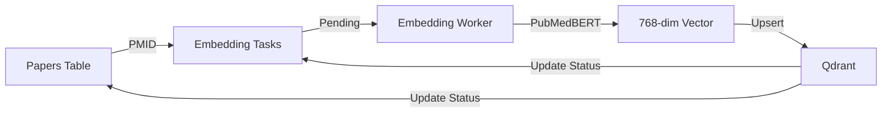
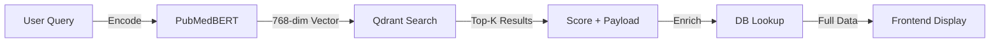

# ✨ 2025-01-scraped-literature-data  

## Premium AI ETL Pipeline for Biomedical Literature  

**Microservice Architecture** · **Team Collaboration Ready**

📚 **Biomedical Literature ETL Pipeline**  
🌐 **PubMed Scraper + Cron Scheduler + Global Console**  
⚙️ **Next.js Admin Panel + FastAPI ETL Engine**  
🧬 **Auto Resume · Batch Processing · Real-time Monitoring**

---

## 🚀 Overview

`2025-01-scraped-literature-data`는  
의학·바이오 분야 (**연구 논문**)의  
대규모 데이터를 안정적으로 수집·정제·정렬하기 위해 설계된  
**AI 기반 엔터프라이즈 ETL 시스템**입니다.

이 프로젝트는 다음과 같은 요구를 해결합니다:

- ❗ 대용량 PubMed 데이터를 자동화된 방식으로 지속 수집하고 싶다  
- ❗ 정확한 중복 제거, 증분 업데이트, Resume-from-last-index가 필요하다  
- ❗ 관리자 패널에서 실행 모드(자동/수동)를 시각적으로 제어하고 싶다  
- ❗ 전역 콘솔(Global Console)에서 ETL 진행 상태를 실시간으로 보고 싶다  
- ❗ 팀원이 빠르게 온보딩할 수 있는 구조가 필요하다  

---

## 🧬 System Architecture

```sh
┌──────────────────────────┐
│       Admin Panel        │  Next.js 15 + React 19
│  - Search Term 분석       │
│  - Manual / Auto ETL     │
│  - 실시간 Progress (%)    │
│  - 글로벌 콘솔             │
└───────────────┬──────────┘
                │
                ▼
┌──────────────────────────┐
│       ETL Engine         │  FastAPI + Python 3.11
│  - PubMed Fetcher        │
│  - PMID 기반 Resume       │
│  - Batch Processing      │
│  - Cron / 1min Pull      │
│  - 중복 제거 / 정제         │
└───────────────┬──────────┘
                │
                ▼
┌──────────────────────────┐
│       Database           │  PostgreSQL 16
│  - papers                │
│  - cron_logs             │
│  - embedding_tasks       │
└───────────────┬──────────┘
                │
                ▼
┌──────────────────────────┐
│       Vector DB          │  Qdrant
│  - PubMedBERT Embeddings │
│  - Semantic Search       │
└──────────────────────────┘
```

---

## 🔍 Key Features

### 1️⃣ Search Term 기반 실시간 분석

- 입력 즉시 Cron Logs 기반으로  
  **총 수집량 · 남은량 · 진행률(%) · 마지막 싱크 시간 (KST)** 출력  
- Apple Spotlight 스타일의 부드러운 인터랙션  

---

### 2️⃣ Manual Run (Resume Mode)

- 마지막 Cron 오프셋 이후부터 이어서 처리  
- Batch-size 만큼 즉시 수집  
- 중복 자동 제거  
- 전역 콘솔(Global Console)에서 즉시 로그 확인 가능  

---

### 3️⃣ Automatic Mode

- 설정 주기마다 자동 수집  
- Pause / Cancel 지원  
- Resume-safe 방식 → 어디서 멈추든 동일 위치에서 이어 실행  

---

### 4️⃣ Real-time Batch Pull (1-minute Mode)

- 전체 데이터 수집 완료 후 활성화  
- 매 1분마다 PubMed 신규 논문 탐지  
- 중복 없이 새 데이터만 저장  
- 실시간 로그 패널(SSE)로 기록 스트리밍  

---

### 5️⃣ Global System Console

Apple Developer Console × Google Cloud Logs 감성의  
최고품질 로그 패널:

```js
[23:20:11] 🔍 Search: 'breast cancer' → Progress 78.4%
[23:20:12] ▶ Manual Resume Started (batch=200, index=103550)
[23:20:14] 📥 Inserted=132 | Skipped=68
[23:20:15] 📍 Updated Index → 103820
[23:20:15] ✔ Completed in 3.8s
```

특징:

- 모든 페이지에서 항상 표시되는 전역 컴포넌트  
- SSE 기반 자동 재연결  
- Dark/Light Mode 완전 대응  

---

## 🗂 Database Schema

### **papers**

| field | type | description |
|-------|------|-------------|
| id | bigint | PK |
| pmid | varchar | PubMed UID |
| pmcid | varchar | PMC ID |
| title | text | 논문 제목 |
| abstract | text | 초록 |
| authors | text | 저자 |
| journal | varchar | 학술지 |
| pubdate | varchar | 출판일 |
| doi | varchar | DOI |
| mesh_terms | text | MeSH 키워드 |
| fulltext_path | varchar | Full-text 저장 경로 |
| embedding_status | varchar | 임베딩 처리 상태 |
| created_at | timestamptz | 저장 시각 |

---

### **embedding_tasks**

| field | type | description |
|-------|------|-------------|
| id | bigint | PK |
| pmid | varchar | PubMed UID |
| status | varchar | pending/processing/done/error |
| error_message | text | 에러 메시지 |
| created_at | timestamptz | 생성 시각 |
| processed_at | timestamptz | 처리 완료 시각 |

---

### **cron_logs**

| field | type | description |
|-------|------|-------------|
| id | bigint | PK |
| keyword | text | 검색어 |
| fetched | int | 가져온 개수 |
| inserted | int | 삽입된 개수 |
| skipped | int | 중복 건너뜀 |
| offset_start | int | 시작 offset |
| offset_end | int | 종료 offset |
| pmid_range_start | varchar | PMID 범위 시작 |
| pmid_range_end | varchar | PMID 범위 끝 |
| run_at | timestamptz | 실행 시간(UTC) |

---

## 🔬 Vector Database (Qdrant)

### Collection Structure

**Collection Name**: `papers`  
**Vector Dimension**: 768 (PubMedBERT embeddings)  
**Distance Metric**: Cosine  
**Current Status**: 369 papers indexed

### Vector Configuration

```json
{
  "vectors": {
    "size": 768,
    "distance": "Cosine"
  },
  "shard_number": 1,
  "replication_factor": 1,
  "on_disk_payload": true
}
```

### Payload Schema

Each vector point contains:

| field | type | description |
|-------|------|-------------|
| pmid | string | PubMed Unique ID |
| title | string | 논문 제목 |
| abstract | string | 초록 (최대 500자) |
| authors | array | 저자 목록 (최대 5명) |
| journal | string | 학술지명 |
| pubdate | string | 출판일 |

### Embedding Model

**Model**: `pritamdeka/S-PubMedBERT-MS-MARCO`  
**Type**: Biomedical domain-specialized BERT  
**Dimension**: 768  
**Batch Size**: 64  
**Device**: CPU (Docker 환경 최적화)

> 💡 **Alternative Model**: `all-MiniLM-L6-v2` (384 dims, faster)  
> ⚠️ 모델 변경 시 Qdrant 컬렉션 재생성 필요!

### Data Verification Commands

```bash
# Qdrant 컨테이너 접속
docker exec -it oaria-lit-qdrant /bin/bash

# 컬렉션 목록 조회
curl http://localhost:6333/collections

# papers 컬렉션 상세 정보
curl http://localhost:6333/collections/papers

# 첫 10개 벡터 데이터 조회 (payload + vector 포함)
curl -X POST http://localhost:6333/collections/papers/points/scroll \
  -H "Content-Type: application/json" \
  -d '{
    "limit": 10,
    "with_payload": true,
    "with_vector": true
  }'

# 특정 PMID 검색 (예: PMID 12345678)
curl -X POST http://localhost:6333/collections/papers/points \
  -H "Content-Type: application/json" \
  -d '{
    "ids": [12345678]
  }'
```

### Embedding Processing Flow



**Processing States**:

- `pending`: 임베딩 대기 중
- `processing`: 임베딩 생성 중
- `done`: Qdrant에 저장 완료
- `error`: 처리 실패

---

### 🧠 RAG Search Result Comparison View

**Frontend Page**: `/rag-compare`  
**Purpose**: Query → Top-K 검색 결과 비교 및 검증

#### Features

##### 1. Natural Language Query

- 자연어 쿼리 입력 (예: "CRISPR gene therapy mechanisms")
- Top-K 설정 (3, 5, 10, 20)
- Enter 키 또는 버튼으로 검색

##### 2. Top-K Results Table

- Rank: 순위 (#1, #2, ...)
- Score: 유사도 점수 (0.0 ~ 1.0)
  - ≥ 0.85: 초록색 (매우 유사)
  - ≥ 0.70: 파란색 (유사)
  - ≥ 0.50: 주황색 (보통)
  - < 0.50: 회색 (낮음)
- PMID: PubMed ID
- Title: 논문 제목

##### 3. Detail View Panel

클릭 시 우측에 상세 정보 표시:

- **Similarity Score**: 점수 + 진행바 시각화
- **Title**: 논문 제목
- **Abstract**: 초록 전문
- **Vector Preview**: 첫 8개 차원 미리보기
- **Full Payload**: JSON 형식 메타데이터

#### API Endpoint

```http
POST /api/rag/search
Content-Type: application/json

{
  "query": "CRISPR gene editing mechanisms",
  "limit": 5
}
```

**Response**:

```json
{
  "query": "CRISPR gene editing mechanisms",
  "results": [
    {
      "id": "12345678",
      "score": 0.8923,
      "payload": {
        "title": "...",
        "abstract": "...",
        "pmid": "12345678",
        "journal": "Nature",
        "pubdate": "2024-01-15",
        "authors": ["Smith J", "Doe A"]
      },
      "vector": [0.123, -0.456, ...] // 첫 20개 차원
    }
  ],
  "total": 5,
  "embedding_dimension": 768
}
```

#### Processing Flow



#### Use Cases

- **Semantic Search Validation**: 검색 품질 확인
- **Embedding Quality Check**: 벡터 유사도 검증
- **Result Comparison**: 여러 결과 비교 분석
- **RAG Pipeline Testing**: RAG 시스템 테스트

---

## 🛠 Tech Stack

### Frontend

- Next.js 15.5.9  
- React 19  
- TypeScript  
- Premium UI System (shadcn + 커스텀)  
- SSE Global Console  

### Backend

- FastAPI  
- Python 3.11  
- PubMed Fetcher (httpx + lxml)  
- SQLAlchemy  
- sentence-transformers (PubMedBERT)  
- Qdrant  

### Database

- PostgreSQL 16  
- Qdrant Vector DB  

### Infrastructure

- Docker Compose (Local / GCP dual mode)  
- Google Cloud Storage (Optional)  

---

## 📁 Project Structure

```

2025-01-scraped-literature-data/
├── frontend/                     # Next.js Admin Panel
│   ├── src/
│   │   ├── pages/
│   │   │   ├── index.tsx
│   │   │   ├── etl.tsx
│   │   │   ├── dashboard.tsx
│   │   │   ├── evidence.tsx
│   │   │   └── admin/
│   │   │       ├── papers.tsx
│   │   │       ├── cron.tsx
│   │   │       └── db.tsx
│   │   ├── components/
│   │   │   ├── Layout.tsx
│   │   │   ├── GlobalConsole.tsx
│   │   │   ├── ResizableConsole.tsx
│   │   │   └── ETLProgress.tsx
│   │   └── styles/
│   └── package.json
│
├── backend/                      # FastAPI ETL Engine
│   ├── src/
│   │   ├── main.py
│   │   ├── config.py
│   │   ├── db.py
│   │   ├── pubmed_client.py
│   │   ├── etl_worker.py
│   │   ├── embedding_worker.py
│   │   ├── qdrant_client.py
│   │   ├── storage_adapter.py
│   │   └── models/
│   └── pyproject.toml
│
├── docker-compose.yml
├── docker-compose.override.local.yml
├── docker-compose.override.gcp.yml
├── Makefile
└── README.md

```

---

## 🚀 Quick Start

### Using Make (Recommended)

```sh

# Local mode (full stack)

make up

# Complete rebuild (down + clean + up)

make rebuild

# GCP mode

make up-gcp

# Stop all

make down

# Clean all data + volumes

make clean

# Backend only

make dev-backend

# Frontend only

make dev-frontend

```

---

## 📡 API Endpoints

### Health & Search

| Method | Endpoint | Description |
|--------|----------|-------------|
| GET | `/api/health` | 헬스체크 |
| GET | `/api/pubmed/count?term=...` | 검색 건수 조회 |
| POST | `/api/pubmed/preview` | PubMed 미리보기 |

---

### ETL Operations

| Method | Endpoint | Description |
|--------|----------|-------------|
| POST | `/api/etl/start` | Manual ETL 실행 |
| GET | `/api/etl/status` | ETL 상태 조회 |
| POST | `/api/etl/stop` | 중단 |
| GET | `/api/etl/search` | 진행률 조회 |
| POST | `/api/etl/auto/start` | Auto ETL 시작 |
| POST | `/api/etl/auto/pause` | 일시정지 |
| POST | `/api/etl/auto/cancel` | 취소 |
| POST | `/api/etl/realtime/start` | 1min Pull 시작 |

---

### Embedding & Vector Search

| Method | Endpoint | Description |
|--------|----------|-------------|
| GET | `/api/embedding/status` | 임베딩 작업 상태 조회 |
| POST | `/api/embedding/process` | 수동 임베딩 처리 |
| GET | `/api/embedding/sync-status` | DB-Qdrant 동기화 상태 |
| POST | `/api/embedding/sync` | 동기화 실행 |
| POST | `/api/rag/search` | 의미 검색 (RAG) |
| GET | `/api/qdrant/count` | Qdrant 벡터 개수 |

---

## 🎨 Development Conventions

### Git Commit Convention

```javascript

<type>(<scope>): <subject>

<body>
<footer>
```

Types: `feat`, `fix`, `docs`, `style`, `refactor`, `test`, `chore`

---

### Code Style

**Frontend** (**TypeScript**)

- 함수형 컴포넌트
- PascalCase / camelCase 규칙

**Backend** (**Python**)

- type hints 필수
- snake_case · PascalCase 분리

---

## 📈 Roadmap (Team Version)

### Q1 2025

- Embedding + Vector DB 통합
- Semantic Search 개선(RAG)
- Dataset 자동 버전 관리
- Topic Modeling 도입

### Q2 2025

- Multi-term Parallel ETL
- GPU Embedding Pipeline
- Multi-cluster Qdrant

---

## 🏆 Vision

이 프로젝트는 단순한 수집기가 아니라
**정밀 의학 연구를 위한** "**표준화된 데이터 수집 엔진**"을 역할을 함

- ETL 품질을 Apple 수준 UI와
- Google 수준 신뢰성을 기반으로 구현
- 데이터 기반 의학 연구의 속도를 극적으로 가속화하는 것이 목표

---

## 📊 Ports

| Service            | Port |
| ------------------ | ---- |
| Backend (FastAPI)  | 8000 |
| Frontend (Next.js) | 3000 |
| PostgreSQL         | 5432 |
| Qdrant             | 6333 |

---

## 👥 Team Notes (for Microservice Collaboration)

- Backend / Frontend 분리 → 독립 빌드 가능
- API 스펙은 `/api/health` 및 `/docs` 참고
- Vector DB(Qdrant)는 선택적 구성 (개발 속도 향상)
- 모든 ETL 작업은 Resume-safe 설계 → 충돌 없음
- 전역 콘솔(Global Console)은 공통 Debug Layer로 사용

---

---

## 📊 Current Data Status

### Database (PostgreSQL)

- **Papers**: 369 papers stored
- **Embedding Tasks**: Processing queue managed
- **Cron Logs**: ETL execution history

### Vector Database (Qdrant)

- **Collection**: papers
- **Indexed Vectors**: 369 papers
- **Vector Dimension**: 768 (PubMedBERT)
- **Distance Metric**: Cosine similarity
- **Status**: ✅ Operational

### Embedding Configuration

- **Model**: pritamdeka/S-PubMedBERT-MS-MARCO
- **Dimension**: 768
- **Batch Size**: 64
- **Processing**: Async background worker

---

**마지막 업데이트**: **2025-12-15**
